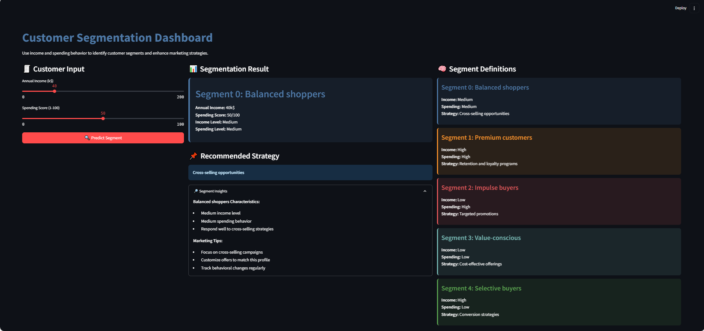

# Mall Customer Segmentation Analysis

## Overview

This project analyzes customer data from a shopping mall to perform customer segmentation using clustering techniques. The goal is to identify distinct customer groups based on their demographics and shopping behavior to enable targeted marketing strategies.

## Project Author

**M. FURQAN KHAN**  
*Data Scientist & Machine Learning Engineer*


### Connect & Explore
[](https://github.com/furqank73)  
[](https://www.kaggle.com/fkgaming)  
[](https://www.linkedin.com/in/furqan-khan-256798268/)

## Dataset

The Mall Customer dataset contains information about individual shoppers with the following features:

### Column Descriptions

| Column Name | Description |
|-------------|-------------|
| **CustomerID** | Unique identifier assigned to each customer |
| **Gender** | Customer's gender (Male or Female) |
| **Age** | Age of the customer (in years) |
| **Annual Income (k$)** | Customer's annual income in thousands of dollars |
| **Spending Score (1-100)** | Score assigned based on customer behavior and spending nature (higher score = higher spending) |

## Analysis Approach

1. **Exploratory Data Analysis (EDA)**
   - Dataset summary statistics
   - Data visualization
   - Feature distribution analysis

2. **Data Preprocessing**
   - Feature scaling

3. **Clustering**
   - K-Means clustering
   - Optimal cluster number determination using the elbow method
   - Cluster visualization

## Key Findings

1. Customers can be segmented into distinct groups based on:
   - Age and spending patterns
   - Income and spending behavior
   - Combined demographic and behavioral characteristics

2. These segments enable:
   - Personalized marketing strategies
   - Improved product targeting
   - Enhanced customer experience and satisfaction

## Streamlit App Implementation

A Streamlit web application has been created to make the customer segmentation analysis interactive and accessible. The app allows users to:

### Features

1. **Data Exploration**
   - Explore statistical summaries
   - Interactive visualizations of customer characteristics

2. **Cluster Analysis**
   - Visualize customer segments
   - Compare different clustering approaches

3. **Customer Insights**
   - Profile analysis of each segment
   - Marketing strategy recommendations per segment
   - Demographic breakdowns

### How to Run the Streamlit App

1. Install required packages:
   ```bash
   pip install streamlit pandas numpy matplotlib seaborn scikit-learn
   ```

2. Download the Mall_Customers.csv dataset

3. Run the Streamlit app:
   ```bash
   streamlit run mall_customer_app.py
   ```

## Technical Stack

  
  
  
  
  
  

## Business Applications

The customer segmentation analysis can help mall management and retailers with:

1. **Targeted Marketing**
   - Customized promotions for different customer segments
   - Personalized communication strategies

2. **Store Layout Optimization**
   - Strategic product placement based on customer profiles
   - Optimal tenant mix planning

3. **Customer Retention**
   - Identifying high-value customers
   - Developing loyalty programs tailored to different segments

## Future Enhancements

1. Incorporate real-time data updates
2. Add predictive modeling for customer spending
3. Implement recommendation systems
4. Expand with additional customer behavior data

## Conclusion

This project demonstrates how data science techniques can extract valuable business insights from customer data. The combination of thorough analysis and an interactive Streamlit app makes the findings accessible to both technical and non-technical stakeholders, enabling data-driven decision making for mall marketing strategies.

For inquiries regarding custom analytics solutions or collaboration opportunities, please reach out through any of the platforms listed above.

# Screenshot of App
